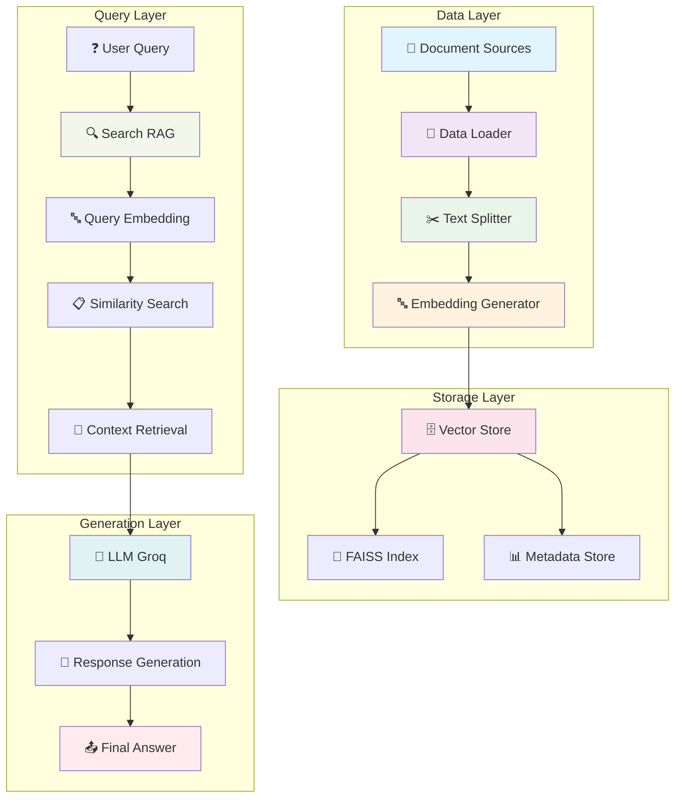
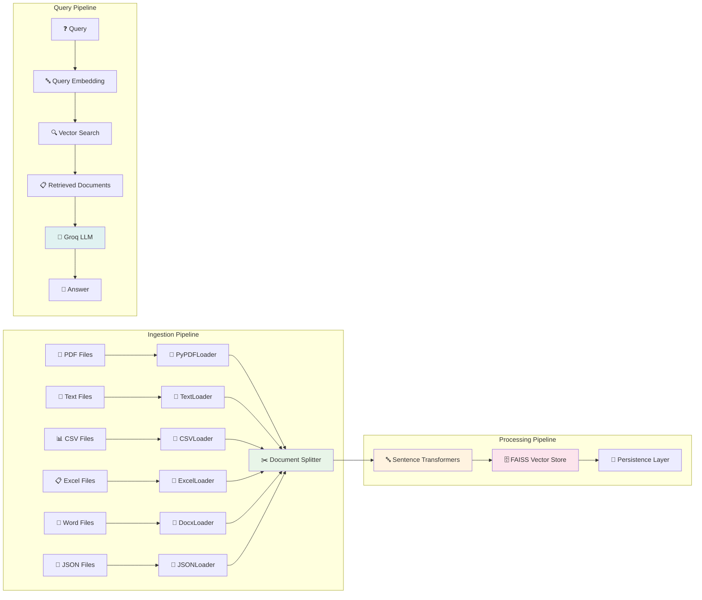
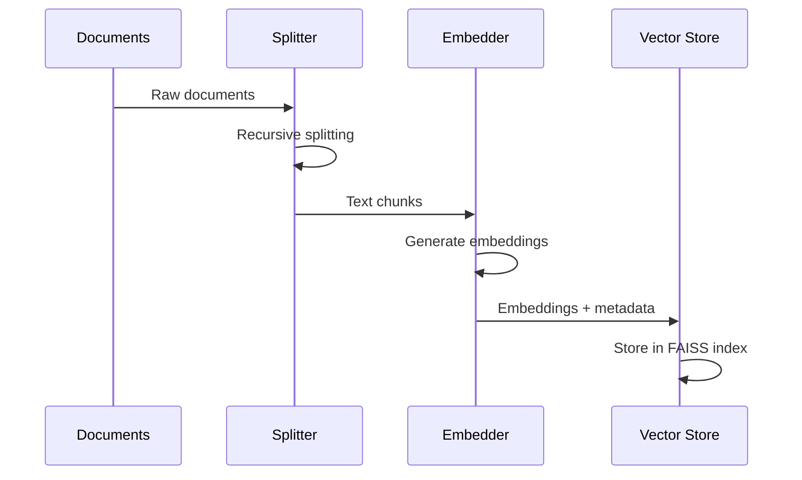
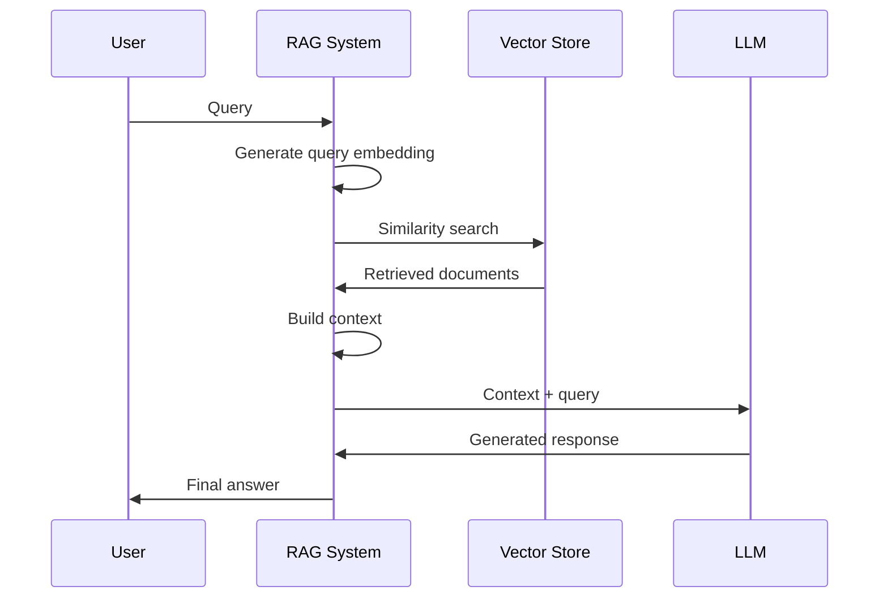

# 🤖 RAG Application - Comprehensive Project Analysis

## 📋 Overview

This project is a **Retrieval-Augmented Generation (RAG)** system that enables intelligent document processing and querying. It combines document ingestion, vector embeddings, semantic search, and LLM-powered response generation to create a comprehensive question-answering system.

---

## 🏗️ System Architecture

### High-Level Architecture Diagram



### Data Flow Pipeline



---

## 📁 Project Structure

```
rag/
├── 📁 data/                          # Data storage
│   ├── 📁 pdf/                       # PDF documents
│   │   ├── 📄 Context.pdf
│   │   └── 📄 OOP notes.pdf
│   ├── 📁 text_value/                # Text files
│   │   ├── 📄 machine_learning.txt
│   │   └── 📄 python_intro.txt
│   └── 📁 vector_store/              # Vector database
│       ├── 🗄️ chroma.sqlite3
│       └── 📂 a01de29e-74f0-453f-b0fd-4286e07d8789/
├── 📁 notebook/                      # Jupyter notebooks
│   ├── 📓 document.ipynb             # Basic document processing
│   └── 📓 pdf.ipynb                  # Advanced PDF pipeline
├── 📁 src/                           # Source code
│   ├── 🐍 __init__.py                # Package initialization
│   ├── 🐍 data_loader.py             # Document loading logic
│   ├── 🐍 embedding.py               # Text embedding generation
│   ├── 🐍 vector_store.py            # Vector database management
│   └── 🐍 search.py                  # RAG search and generation
├── 📁 assets/                        # Visual assets
│   ├── 🎨 logo.svg
│   └── 🎬 demo.gif
├── 🐍 main.py                        # CLI entry point
├── 🐍 app.py                         # Application example
├── 📋 requirements.txt               # Dependencies
├── 📦 pyproject.toml                # Project configuration
└── 📖 README.md                      # Documentation
```

---

## 🔧 Core Components

### 1. Data Loader (`src/data_loader.py`)

**Purpose**: Load and process various document formats

**Supported Formats**:
- 📄 **PDF**: Using `PyPDFLoader` and `PyMuPDFLoader`
- 📝 **Text**: Using `TextLoader` with UTF-8 encoding
- 📊 **CSV**: Using `CSVLoader`
- 📋 **Excel**: Using `UnstructuredExcelLoader`
- 📄 **Word**: Using `Docx2txtLoader`
- 🔧 **JSON**: Using `JSONLoader` with JQ schema

**Key Features**:
- Recursive directory scanning
- Error handling for each file type
- Debug logging for troubleshooting
- Returns LangChain Document objects

### 2. Embedding Generator (`src/embedding.py`)

**Purpose**: Convert text chunks into vector embeddings

**Technology Stack**:
- **Model**: `all-MiniLM-L6-v2` (Sentence Transformers)
- **Chunking**: `RecursiveCharacterTextSplitter`
- **Dimensions**: 384-dimensional embeddings

**Configuration**:
```python
chunk_size = 1000      # Characters per chunk
chunk_overlap = 200    # Overlap between chunks
separators = ["\n\n", "\n", " ", ""]
```

### 3. Vector Store (`src/vector_store.py`)

**Purpose**: Store and retrieve document embeddings

**Technology**: FAISS (Facebook AI Similarity Search)

**Features**:
- **Persistence**: Saves index and metadata to disk
- **Similarity Search**: L2 distance-based retrieval
- **Metadata Storage**: Preserves document context
- **Auto-initialization**: Builds from documents if not exists

**Storage Structure**:
```
faiss_store/
├── faiss.index          # FAISS vector index
└── metadata.pkl         # Document metadata
```

### 4. Search RAG (`src/search.py`)

**Purpose**: End-to-end RAG query processing

**Components**:
- **Vector Store Integration**: Semantic document retrieval
- **LLM Integration**: Groq API for response generation
- **Context Assembly**: Combines retrieved documents
- **Prompt Engineering**: Structured query-response format

**LLM Configuration**:
- **Provider**: Groq
- **Model**: `llama-3.1-8b-instant` (default)
- **Authentication**: Environment variable `GROQ_API_KEY`

---

## 🚀 Usage Patterns

### 1. Command Line Interface (`main.py`)

**Single Query Mode**:
```bash
python main.py "What is context engineering?" --top-k 3
```

**Interactive Mode**:
```bash
python main.py
# Enter interactive Q&A session
```

**Configuration Options**:
- `--top-k`: Number of documents to retrieve (default: 3)
- `--model`: LLM model selection (default: llama-3.1-8b-instant)

### 2. Programmatic Usage (`app.py`)

```python
from src.data_loader import Load_all_documents
from src.vector_store import FaissVectorStore
from src.search import SearchRag

# Load documents
docs = Load_all_documents("data")

# Initialize vector store
store = FaissVectorStore("faiss_store")
store.build_from_documents(docs)

# Initialize RAG search
rag_search = SearchRag()
result = rag_search.search_summarize("What is context engineering?", top_k=3)
```

### 3. Jupyter Notebook Workflows

**Document Processing** (`document.ipynb`):
- LangChain Document structure exploration
- Text loading and directory scanning
- PDF processing with PyMuPDF

**Complete RAG Pipeline** (`pdf.ipynb`):
- End-to-end document processing
- Embedding generation and storage
- Retrieval and generation pipeline
- Advanced RAG with streaming and citations

---

## 🔍 Technical Implementation Details

### Embedding Process



### Query Processing Flow



---

## 🛠️ Technology Stack

### Core Dependencies

| Component | Technology | Version | Purpose |
|-----------|------------|---------|---------|
| **Framework** | LangChain | 1.2.12+ | RAG orchestration |
| **LLM** | Groq | - | Response generation |
| **Embeddings** | Sentence Transformers | - | Text vectorization |
| **Vector DB** | FAISS | - | Similarity search |
| **Document Processing** | PyMuPDF, PyPDF | - | PDF handling |
| **Environment** | Python | 3.13+ | Runtime |

### Optional Dependencies

| Package | Purpose |
|---------|---------|
| ChromaDB | Alternative vector store |
| Transformers | Additional embedding models |
| python-dotenv | Environment variable management |

---

## 📊 Performance Characteristics

### Embedding Generation
- **Model**: all-MiniLM-L6-v2
- **Dimensions**: 384
- **Speed**: ~1.5 seconds per 100 chunks
- **Memory**: ~500MB for model loading

### Vector Search
- **Index Type**: FAISS IndexFlatL2
- **Similarity**: L2 distance
- **Retrieval Speed**: <10ms for typical queries
- **Scalability**: Handles millions of vectors

### Document Processing
- **Supported Formats**: 6 (PDF, TXT, CSV, Excel, Word, JSON)
- **Chunk Size**: 1000 characters
- **Overlap**: 200 characters
- **Processing Speed**: ~100 pages/minute

---

## 🔧 Configuration and Customization

### Environment Variables

```bash
# Required for LLM functionality
GROQ_API_KEY=your_groq_api_key

# Optional configuration
RAG_DATA_DIR=./data
RAG_CHUNK_SIZE=1000
RAG_CHUNK_OVERLAP=200
RAG_EMBEDDING_MODEL=all-MiniLM-L6-v2
```

### Custom Embedding Models

```python
# Use different embedding model
custom_store = FaissVectorStore(
    embedding_model="all-mpnet-base-v2"  # Larger model, better quality
)
```

### Chunking Strategies

```python
# Custom chunking configuration
text_splitter = RecursiveCharacterTextSplitter(
    chunk_size=1500,      # Larger chunks
    chunk_overlap=300,    # More overlap
    separators=["\n\n", "\n", ". ", " ", ""]
)
```

---

## 🚧 Advanced Features

### 1. Streaming Responses
- Real-time token generation
- Progressive answer building
- Enhanced user experience

### 2. Citation System
- Source attribution
- Confidence scoring
- Document metadata tracking

### 3. Conversation History
- Context preservation
- Multi-turn dialogue
- History-aware responses

### 4. Multiple Vector Stores
- FAISS for performance
- ChromaDB for persistence
- Hybrid approaches possible

---

## 🔮 Future Enhancements

### Planned Features
- [ ] **Web Interface**: Streamlit/FastAPI frontend
- [ ] **Multi-modal Support**: Image and audio processing
- [ ] **Advanced RAG**: Query rewriting, decomposition
- [ ] **Evaluation Framework**: RAG quality metrics
- [ ] **Deployment**: Docker containerization
- [ ] **Monitoring**: Performance and usage analytics

### Scalability Improvements
- [ ] **Distributed Processing**: Multiple document loaders
- [ ] **Caching Layer**: Redis for frequent queries
- [ ] **Batch Processing**: Bulk document ingestion
- [ ] **Cloud Storage**: S3/Azure integration

---

## 📈 Use Cases and Applications

### 1. **Academic Research**
- Paper analysis and summarization
- Literature review automation
- Research question answering

### 2. **Business Intelligence**
- Document knowledge base
- Report analysis
- Policy and procedure queries

### 3. **Education**
- Study material processing
- Homework assistance
- Concept explanation

### 4. **Healthcare**
- Medical document analysis
- Clinical decision support
- Research literature queries

---

## 🎯 Best Practices

### Document Preparation
- Use clean, well-structured documents
- Ensure consistent formatting
- Remove unnecessary metadata

### Query Optimization
- Use specific, targeted questions
- Include relevant context
- Experiment with different top-k values

### Performance Tuning
- Monitor embedding generation time
- Optimize chunk size for your documents
- Consider GPU acceleration for large scale

---

## 📞 Support and Maintenance

### Troubleshooting Common Issues

1. **Empty Vector Store**: Check document loading and embedding generation
2. **Poor Results**: Adjust chunk size and overlap parameters
3. **API Errors**: Verify GROQ_API_KEY configuration
4. **Memory Issues**: Reduce batch size or use streaming processing

### Monitoring and Logging

- Debug logging throughout the pipeline
- Performance metrics collection
- Error tracking and reporting

---

## 📄 License and Credits

- **License**: MIT License
- **Framework**: LangChain Community
- **Embeddings**: Sentence Transformers
- **Vector Search**: Facebook AI Research (FAISS)
- **LLM**: Groq (Llama models)

---

*Last Updated: March 2026*
*Project Version: 0.1.0*
