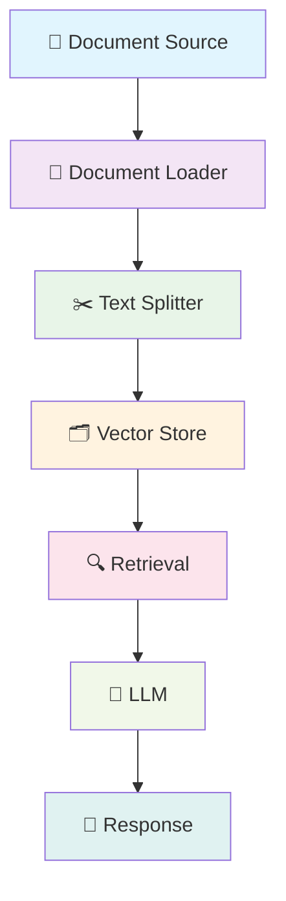

# 🤖 RAG Application

<div align="center">


**A comprehensive Retrieval-Augmented Generation (RAG) system for intelligent document processing and querying**

[](https://python.org)
[](https://langchain.com)
[](LICENSE)

</div>

---

## 📖 Table of Contents

- [🌟 Features](#-features)
- [🏗️ Architecture](#️-architecture)
- [🚀 Quick Start](#-quick-start)
- [📦 Installation](#-installation)
- [🛠️ Usage](#️-usage)
- [📁 Project Structure](#-project-structure)
- [🔧 Configuration](#-configuration)
- [📊 Examples](#-examples)
- [🤝 Contributing](#-contributing)
- [📄 License](#-license)

---

## 🌟 Features

### 🎯 Core Functionality
- **📚 Multi-format Document Support**: Process PDF and text files seamlessly
- **🔄 Intelligent Chunking**: Advanced text splitting for optimal retrieval
- **🔍 Smart Retrieval**: Efficient document similarity search
- **💬 Context-aware Responses**: Generate answers with relevant document context

### 🛠️ Technical Features
- **🐍 Python 3.13+**: Modern Python with latest features
- **⚡ LangChain Integration**: Leverage cutting-edge RAG framework
- **📊 Jupyter Notebooks**: Interactive development and testing
- **🔧 Modular Design**: Easy to extend and customize

---

## 🏗️ Architecture



### 🔄 Pipeline Flow

1. **📥 Data Ingestion**: Load documents from various formats
2. **🔨 Processing**: Split documents into manageable chunks
3. **🗄️ Storage**: Store chunks in vector database
4. **🔎 Retrieval**: Find relevant chunks for queries
5. **🧠 Generation**: Generate context-aware responses

---

## 🚀 Quick Start

### 🏃‍♂️ Get Started in 3 Steps

<div align="center">

```bash
# 1️⃣ Clone the repository
git clone https://github.com/yourusername/rag.git
cd rag

# 2️⃣ Install dependencies
pip install -r requirements.txt

# 3️⃣ Run the application
python main.py
```

</div>

### 📊 Quick Demo

<div align="center">


</div>

```python
from rag import RAGSystem

# Initialize RAG system
rag = RAGSystem()

# Load documents
rag.load_documents("./data")

# Query the system
response = rag.query("What is context engineering?")
print(response)
```

---

## 📦 Installation

### 🐍 Prerequisites

- **Python 3.13+**
- **pip** or **uv** package manager

### 📋 Dependencies

```bash
# Core dependencies
pip install langchain>=1.2.12
pip install langchain-community>=0.4.1
pip install langchain-core>=1.2.18
pip install pymupdf>=1.27.2
pip install pypdf>=6.8.0

# Development dependencies
pip install ipykernel>=7.2.0
```

### 🔧 Using UV (Recommended)

```bash
# Install with UV for faster dependency resolution
uv pip install -r requirements.txt
```

---

## 🛠️ Usage

### 📁 Document Processing

```python
from langchain_community.document_loaders import PyPDFLoader
from langchain_text_splitters import RecursiveCharacterTextSplitter

# Load PDF documents
loader = PyPDFLoader("document.pdf")
documents = loader.load()

# Split into chunks
text_splitter = RecursiveCharacterTextSplitter(
    chunk_size=1000,
    chunk_overlap=200
)
chunks = text_splitter.split_documents(documents)
```

### 📊 Jupyter Notebook Examples

Explore the interactive notebooks in the `notebook/` directory:

- **`document.ipynb`**: Basic document loading and processing
- **`pdf.ipynb`**: Advanced PDF processing pipeline

### 🔍 Query Examples

```python
# Example queries
queries = [
    "What is context engineering?",
    "How do agents work in RAG systems?",
    "Explain chunking strategies"
]

for query in queries:
    result = rag.query(query)
    print(f"Q: {query}")
    print(f"A: {result}\n")
```

---

## 📁 Project Structure

```
rag/
├── 📁 data/                    # Document storage
│   ├── 📁 pdf/                 # PDF documents
│   └── 📁 text_value/          # Text files
├── 📁 notebook/                # Jupyter notebooks
│   ├── 📓 document.ipynb        # Basic processing
│   └── 📓 pdf.ipynb            # PDF pipeline
├── � assets/                  # Visual assets
│   ├── 🎨 logo.svg              # Project logo
│   └── 🎬 demo.gif              # Demo animation
├── �� main.py                  # Main application entry
├── 📋 requirements.txt         # Python dependencies
├── 📦 pyproject.toml          # Project configuration
└── 📖 README.md               # This file
```

---

## 🔧 Configuration

### ⚙️ Environment Variables

```bash
# Optional: Set up environment variables
export RAG_DATA_DIR="./data"
export RAG_CHUNK_SIZE=1000
export RAG_CHUNK_OVERLAP=200
```

### 🎛️ Chunking Parameters

```python
# Customize chunking behavior
text_splitter = RecursiveCharacterTextSplitter(
    chunk_size=1000,      # Size of each chunk
    chunk_overlap=200,    # Overlap between chunks
    length_function=len,  # Length calculation function
    separators=["\n\n", "\n", " ", ""]  # Splitting priorities
)
```

---

## 📊 Examples

### 🎯 Real-world Use Cases

#### 📚 Academic Research
```python
# Process research papers
rag.load_documents("./research_papers/")
answer = rag.query("What are the latest findings in machine learning?")
```

#### 💼 Business Documents
```python
# Process business reports
rag.load_documents("./reports/")
answer = rag.query("What were the Q3 revenue figures?")
```

#### 🏥 Healthcare
```python
# Process medical documents
rag.load_documents("./medical_records/")
answer = rag.query("What are the symptoms of condition X?")
```

---

## 🤝 Contributing

### 🌟 How to Contribute

1. **🍴 Fork the repository**
2. **🌿 Create a feature branch**
   ```bash
   git checkout -b feature/amazing-feature
   ```
3. **📝 Commit your changes**
   ```bash
   git commit -m "Add amazing feature"
   ```
4. **📤 Push to the branch**
   ```bash
   git push origin feature/amazing-feature
   ```
5. **🔄 Open a Pull Request**

### 🎯 Contribution Guidelines

- ✅ Follow Python PEP 8 style guidelines
- ✅ Add tests for new features
- ✅ Update documentation
- ✅ Keep code clean and readable

---

## 📄 License

This project is licensed under the MIT License - see the [LICENSE](LICENSE) file for details.

---

## 🙏 Acknowledgments

- **🦜 LangChain Team**: For the amazing RAG framework
- **🐍 Python Community**: For the robust ecosystem
- **📚 OpenAI**: For pioneering LLM research

---

## 📞 Contact

- **👨‍💻 Author**: [Your Name]
- **📧 Email**: [your.email@example.com]
- **🐙 GitHub**: [@yourusername](https://github.com/yourusername)

---

<div align="center">

**⭐ If this project helped you, give it a star!**

Made with ❤️ and 🐍 Python

</div>

---

## 🎉 Updates & Changelog

### 📅 Version 0.1.0
- ✨ Initial release
- 📚 PDF and text document support
- 🔍 Basic RAG functionality
- 📓 Jupyter notebook examples

---

*Last updated: March 2026*